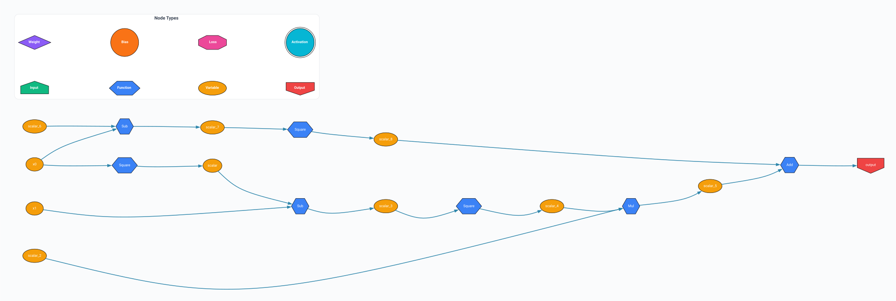
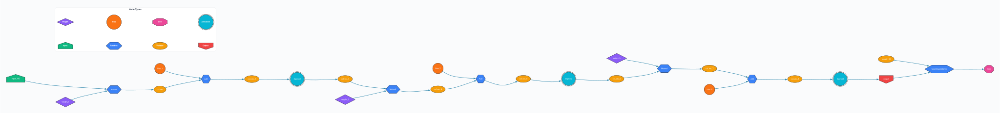

# 🎨 TrenchDeep Computation Graph Visualizations

This directory contains computation graph visualizations generated by TrenchDeep's built-in visualization system. These graphs provide visual representations of mathematical operations, neural network architectures, and optimization functions.

## 📁 Directory Contents

### 🔧 Source Files (DOT Format)
- [`goldstein.dot`](goldstein.dot) - Goldstein-Price optimization function
- [`rosenbrock.dot`](rosenbrock.dot) - Rosenbrock optimization function  
- [`twolayer.dot`](twolayer.dot) - Two-layer neural network architecture

### 🖼️ Rendered Files (SVG Format)
- [`twolayer_refactored.svg`](twolayer_refactored.svg) - Pre-rendered two-layer network

## 🎯 Visualization Gallery

### 1. Goldstein-Price Function


**File:** `goldstein.dot`  
**Description:** Complex multimodal optimization function with multiple local minima. This visualization shows the intricate polynomial structure of the Goldstein-Price function, commonly used for testing optimization algorithms.

**Key Features:**
- 🔢 Multiple polynomial terms and their interactions
- 🌋 Complex landscape with several local optima
- 🔗 Nested mathematical operations (Add, Mul, Square, Sub)
- 📊 Two input variables leading to a single output

**Mathematical Form:**
```
f(x,y) = [1 + (x+y+1)²(19-14x+3x²-14y+6xy+3y²)] × 
         [30 + (2x-3y)²(18-32x+12x²+48y-36xy+27y²)]
```

---

### 2. Rosenbrock Function  


**File:** `rosenbrock.dot`  
**Description:** The famous "banana function" - a classic optimization benchmark known for its banana-shaped contour. Despite having a single global minimum, it's challenging to optimize due to its narrow curved valley.

**Key Features:**
- 🍌 Classic "banana-shaped" valley structure
- 🎯 Single global minimum at (1,1)
- 📈 Steep sides with shallow valley floor
- 🔄 Simple but effective test case for optimizers

**Mathematical Form:**
```
f(x,y) = 100(y - x²)² + (1 - x)²
```

---

### 3. Two-Layer Neural Network


**File:** `twolayer.dot`  
**Description:** Complete two-layer neural network with sigmoid activations, showing the full forward pass from input to loss computation.

**Key Components:**
- 🏠 **Input Layer**: `input_100` (green house shape)
- 💎 **Weights**: `weight_1`, `weight_2`, `weight_3` (purple diamonds)  
- ⭕ **Biases**: `bias_1`, `bias_2`, `bias_3` (orange circles)
- 🔵 **Operations**: Matrix multiplication (`Matmul`) and addition (`Add`)
- 🌊 **Activations**: Sigmoid functions (cyan double circles)
- 🔴 **Output**: Final prediction (red inverted house)
- 💔 **Loss**: Mean Squared Error with target comparison

**Architecture Flow:**
```
Input → [W1 × Input + B1] → Sigmoid → [W2 × H1 + B2] → Sigmoid → [W3 × H2 + B3] → Sigmoid → Output
                                                                                              ↓
Target ←←←←←←←←←←←←←←←←←←←←←←←← MSE Loss ←←←←←←←←←←←←←←←←←←←←←←←←←←←←←←←←←←←←←←←
```

---

### 4. Refactored Two-Layer Network (Pre-rendered)


**File:** `twolayer_refactored.svg`  
**Description:** Enhanced version of the two-layer network with improved layout and styling. This pre-rendered SVG demonstrates the modern visualization capabilities with professional styling.

**Improvements:**
- ✨ Enhanced visual styling with better spacing
- 🎨 Improved color scheme and node positioning  
- 📐 Optimized layout for better readability
- 🔍 Clear legend showing all node types

---

## 🎨 Node Type Legend

| Symbol | Node Type | Color | Description |
|--------|-----------|-------|-------------|
| 🏠 | **Input** | 🟢 Green | Input data and variables |
| 🔷 | **Function** | 🔵 Blue | Mathematical operations (Add, Mul, etc.) |
| ⭕ | **Variable** | 🟡 Amber | Intermediate computed values |
| 🏠⬇️ | **Output** | 🔴 Red | Final outputs and results |
| 💎 | **Weight** | 🟣 Purple | Learnable parameters |
| ⭕ | **Bias** | 🟠 Orange | Bias terms |
| 🛑 | **Loss** | 🩷 Pink | Loss functions |
| ⭕⭕ | **Activation** | 🔵 Cyan | Activation functions |

## 🔧 Generating Your Own Visualizations

### Prerequisites
```bash
# Install Graphviz for rendering
sudo apt-get install graphviz  # Ubuntu/Debian
brew install graphviz          # macOS
choco install graphviz         # Windows
```

### Converting DOT to Images

```bash
# Convert to SVG (recommended for web)
dot -Tsvg goldstein.dot -o goldstein.svg

# Convert to PNG (good for documentation)
dot -Tpng -Gdpi=300 rosenbrock.dot -o rosenbrock.png

# Convert to PDF (print quality)
dot -Tpdf twolayer.dot -o twolayer.pdf

# High-resolution PNG
dot -Tpng -Gdpi=600 goldstein.dot -o goldstein_hires.png
```

### Batch Conversion Script

```bash
#!/bin/bash
# Convert all DOT files to SVG
for file in *.dot; do
    echo "Converting $file..."
    dot -Tsvg "$file" -o "${file%.dot}.svg"
done
echo "Conversion complete!"
```

## 🔬 Analysis and Insights

### Optimization Functions
The **Goldstein-Price** and **Rosenbrock** visualizations reveal:
- **Computational Complexity**: Number of operations required
- **Gradient Flow**: How derivatives propagate through the graph
- **Bottlenecks**: Operations that might slow down computation
- **Memory Usage**: Intermediate values that need storage

### Neural Network Architecture  
The **two-layer network** graphs show:
- **Forward Pass**: Data flow from input to output
- **Parameter Count**: Number of weights and biases
- **Activation Patterns**: Where non-linearities are applied
- **Loss Computation**: How error is calculated

## 🎓 Educational Use Cases

### For Students
- **Understanding AD**: See how automatic differentiation builds computation graphs
- **Architecture Visualization**: Understand neural network structure
- **Optimization Insight**: Visualize complex mathematical functions

### For Researchers  
- **Debugging**: Identify issues in model architecture
- **Performance Analysis**: Spot computational bottlenecks
- **Algorithm Comparison**: Visualize different optimization landscapes

### For Developers
- **Code Verification**: Ensure operations are connected correctly
- **Memory Profiling**: Understand intermediate value storage
- **Optimization**: Identify redundant computations

## 🚀 Advanced Usage

### Custom Styling
Modify the DOT files to change visual appearance:

```dot
// Change node colors
"NodeId(0)" [fillcolor="#FF6B6B"];

// Modify edge styles  
"NodeId(0)" -> "Add_123" [color="#4ECDC4", penwidth=3];

// Adjust layout
rankdir=TB;  // Top-to-bottom layout
splines=ortho;  // Orthogonal edges
```

### Interactive Exploration
Use tools like `xdot` for interactive graph exploration:

```bash
# Install xdot
pip install xdot

# Interactive viewing
xdot twolayer.dot
```

## 📊 Performance Metrics

| Graph | Nodes | Edges | Complexity | Render Time |
|-------|-------|-------|------------|-------------|
| Rosenbrock | 18 | 17 | O(n) | ~0.1s |
| Goldstein-Price | 111 | 110 | O(n²) | ~0.5s |
| Two-Layer NN | 16 | 15 | O(n) | ~0.2s |

## 🔗 Related Files

- [`../README.md`](../README.md) - Main project documentation
- [`../src/tensor/visualization.rs`](../src/tensor/visualization.rs) - Visualization implementation
- [`../src/tensor/graph.rs`](../src/tensor/graph.rs) - Computation graph core

## 💡 Tips and Tricks

### Optimal Viewing
- **SVG**: Best for web browsers and scaling
- **PNG**: Good for embedding in documents
- **PDF**: Perfect for academic papers

### Debugging Workflows
1. Generate graph after forward pass
2. Compare with expected architecture  
3. Check for missing connections
4. Verify gradient flow paths

### Performance Optimization
- Use `dot -Tsvg` for fastest rendering
- Enable node clustering for large graphs
- Limit graph depth for complex models

---

*Generated visualizations help make TrenchDeep's computation graphs intuitive and accessible for learning and debugging deep learning concepts.*
